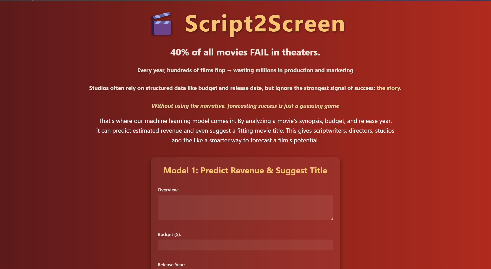

# 🎥 Script2Screen

 <!-- replace with actual path if you want to show a screenshot -->

## Inspiration

I was initially having trouble deciding which aspect of pop culture to focus my project on. Naturally, the conversation drifted and I started listing out the recent movies I’d seen and my thoughts on them. I seemed to dislike the same movies that also flopped financially — and after researching, it became clear that many of them failed because of weak stories. In discussing my critiques, they mainly lay within the story. Thus, my idea stemmed here. I wanted to build a studio-facing system that analyzes the success of a film based on its core screenplay.

At the end of the day, I believe the success of a film lies in its story, and I explored this through my project.

## What it does

My final idea ended up being two models used at different phases of the film-making process. Firstly, I have the Ideation Model – a model meant for screenwriters and producers to test the potential of a synopsis while experimenting with budget and release year. The second model, the Pre-Production Model, is meant to be used right before production starts. The studio can input the finalized budget, genre, production studio, and more features to get a revenue-and-ROI-based success classification: Flop, Average, Hit, or Blockbuster!

## How I built it

I first found a dataset from The Movies Database (TMDB) with data up to 2024 and multiple revenue and production features. I cleaned it thoroughly to remove missing values in my chosen features for both models and created new columns for profit and ROI in order to properly train for success classification in the Pre-Production Model.

I built the frontend of the public-facing website using HTML, CSS, and JavaScript, focusing on creating a user-friendly and visually engaging experience. On the backend, I used Flask to deploy both of my machine learning models, ensuring smooth and efficient interactions for users. For the model, I used the scikit-learn package in Python and incorporated a TFIDF Vectorizer, Binarizer, OneHotEncoder, StandardScaler, MultiLabelBinarizer, and custom transformers.

## Challenges I ran into

One of the biggest challenges I faced was dealing with missing or messy financial information such as budgets, revenues, and release dates. The large variety of movie genres and global audiences added complexity; a movie might succeed in one market but fail in another. From a technical standpoint, it was challenging to combine structured numerical data (like runtime and budget) with unstructured text data (like the plot synopsis). It required careful feature engineering to capture both types of information meaningfully. Additionally, the limited number of movies with both complete plot and revenue data made it harder to train models that generalize well.

## Accomplishments that I’m proud of

Some accomplishments that I’m proud of are successfully coming up with my idea, obtaining datasets, and cleaning them in a short time. My brainstorming process was efficient as I combined different ideas to land on a good topic. Next, I worked to obtain the dataset and discussed ways I could clean it to best model my idea. I believe this method of collaboration in the early stages proved more efficient than splitting up the work.

## What I learned

I learned how to use Flask to build and deploy the backend/frontend of my web application, which allowed me to connect user inputs with the machine learning models. I also gained hands-on experience with Natural Language Processing, using TfidfVectorizer to transform movie synopses into meaningful numerical representations, and polarity scores to analyze sentiment and emotion in synopses. By extrapolating different features from text, I gained a better understanding of textual analysis overall.

## What’s next for Script2Screen

I plan to make Script2Screen more interactive by incorporating genre-specific visualizations, confidence intervals for revenue predictions, and personalized recommendations for improving a synopsis. I’m also looking for ways to integrate public datasets like box office trends or critic sentiment to further contextualize predictions. Ultimately, the goal of my project is to have Script2Screen become a go-to tool for indie creators, scriptwriters, and studios to test and pitch ideas instantly with data-driven insights.
